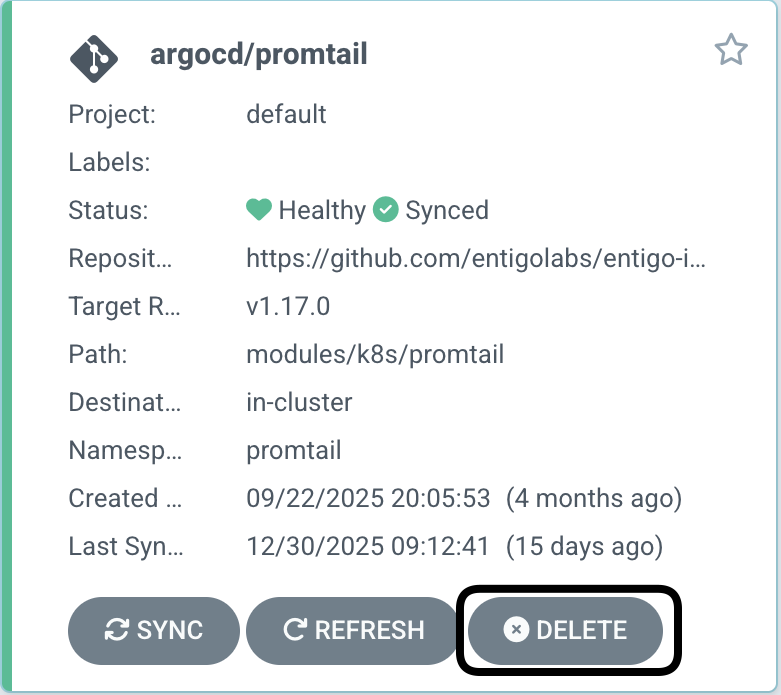

## Deprecated

This module is no longer actively developed. Please use k8s/alloy module instead.

## Migration from k8s/promtail to k8s/alloy

1. Replace promtail with alloy in the agent configuration argocd-apps step.

   Before:

   ```yaml
      - name: apps
        type: argocd-apps
        modules:
            ...
            - name: promtail
              source: promtail
            ...
   ```

   After:

   ```yaml
      - name: apps
        type: argocd-apps
        modules:
            ...
            - name: alloy
              source: alloy
            ...
   ```

2. Run the infralib agent. Verify that the pipeline is successful.

3. Verify Alloy starts up successfully by checking the Alloy app in ArgoCD UI. Verify that pods are running and there are no errors in the logs.

4. Delete promtail app in ArgoCD UI.
   

5. Delete promtail namespace with `kubectl delete namespace promtail`.

6. Verify in Grafana that new logs picked up by Alloy are present.
